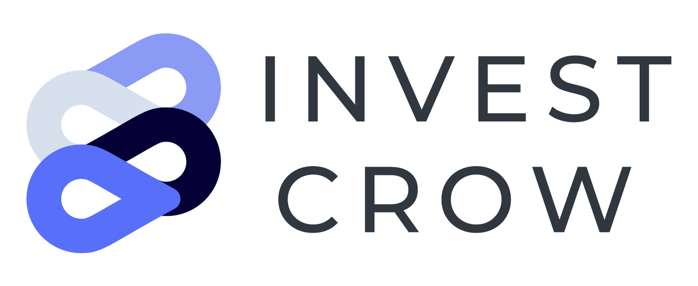

<!-- PROJECT LOGO -->
<br />
<p align="center">
  <a href="https://github.com/rohitbakoliya/investcrow">
    
  </a>

  <h3 align="center">We Build Trust!</h3>
  <p align="center">
    <a href="https://youtu.be/N7qoeswWyU8">Demo</a>
    •
    <a href="https://investcrow.herokuapp.com" >Website</a>
  </p>

</p>

<!-- TABLE OF CONTENTS -->
<details open="open">
  <summary>Table of Contents</summary>
  <ol>
    <li>
      <a href="#about-the-project">About The Project</a>
    </li>
    <li> 
      <a href="#technologies-we-used">Technologies we used</a>
    </li>
    <li><a href="#installation">Installation</a></li>
    <li><a href="#workflow">Workflow</a></li>
    <li><a href="#authors">Authors</a></li>
  </ol>
</details>

<!-- ABOUT THE PROJECT -->

## About The Project

An initial coin offering (ICO) is the cryptocurrency industry’s equivalent to an initial public
offering (IPO). However, unlike IPO, currently there is no intermediate regulatory body for keeping
check on transactions. This leads to lack of trust between investors and companies.Our platform
allows startup to propose an agreement to the investor. This allows to transfer tokens(in case of
startups) and money(in case of investors) to the smart contract deployed on blockchain(Ethereum).
Only after both parties have approved the agreement, the tokens and money will be transferred to
investor and startup respectively.

### Technologies We Used

- [MongoDB](https://www.mongodb.com/)
- [Expressjs](https://expressjs.com/)
- [Reactjs](https://reactjs.org/)
- [Nodejs](https://nodejs.org/en/)
- [Solidity](https://docs.soliditylang.org/en/v0.8.2/)
- [web3js](https://web3js.readthedocs.io/en/v1.3.4/)
- [Infura](https://infura.io/)
- [Portis](https://www.portis.io/)
- [Ganache(for testing)](https://www.trufflesuite.com/ganache)
- [Remix(for testing)](https://remix.ethereum.org)

<!-- GETTING STARTED -->

### Installation

1. Clone the repo
   ```sh
   git clone https://github.com/rohitbakoliya/investcrow
   ```
2. Install NPM packages
   ```sh
   npm install
   cd client && npm install
   ```
3. Copy .env.example into .env file and update with your credentials

4. ```sh
   bash script.sh
   npm run dev
   ```
5. This will start your project at `localhost:3000`

Note: after updating solidity contracts, then you need to run `node scripts/compile.js` and `node scripts/deploy.js`

<!-- USAGE EXAMPLES -->

<!-- workflow -->

## Workflow

![Workflow][workflow-image]

<!-- ACKNOWLEDGEMENTS -->

## Authors

- Smit Patel
- Hardik Upadhyay
- Rohit Bakoliya

<!-- MARKDOWN LINKS & IMAGES -->
<!-- https://www.markdownguide.org/basic-syntax/#reference-style-links -->

[workflow-image]: assets/workflow.png

<!-- LICENSE -->

## License

Distributed under the MIT License. See `LICENSE` for more information.
